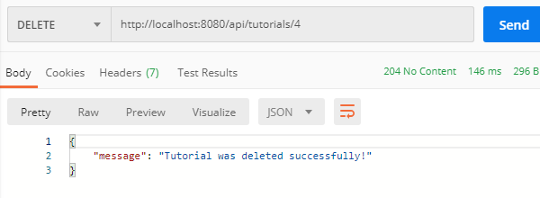

# Django CRUD PostgreSQL REST API

This project demonstrates a CRUD REST API developed using Django REST framework and PostgreSQL database

## Prerequisites

* Python 3.7
* Django 2.1.15
* Django Rest Framework 3.11.0
* psycopg2 2.8.5
* django-cors-headers 3.2.1

## Lauching REST API

```sh
python manage.py runserver 8080
```
## Test API using Postman

1. Create a new Tutorial using POST /tutorials Api


2. Retrieve all Tutorials using GET /tutorials Api


3. Retrieve a singel Tutorial by id using GET /tutorials/:id Api


4. Update a Tutorial using PUT /tutorials/:id Api


5. Find all Tutorials which title contains 'pos': GET /tutorials?title=pos


6. Find all published Tutorials using GET /tutorials/published Api


7. Delete a Tutorial using DELETE /tutorials/:id Api




8. Delete all Tutorials using DELETE /tutorials Api


## References

1. Tutorial (<https://bezkoder.com/django-postgresql-crud-rest-framework/>)